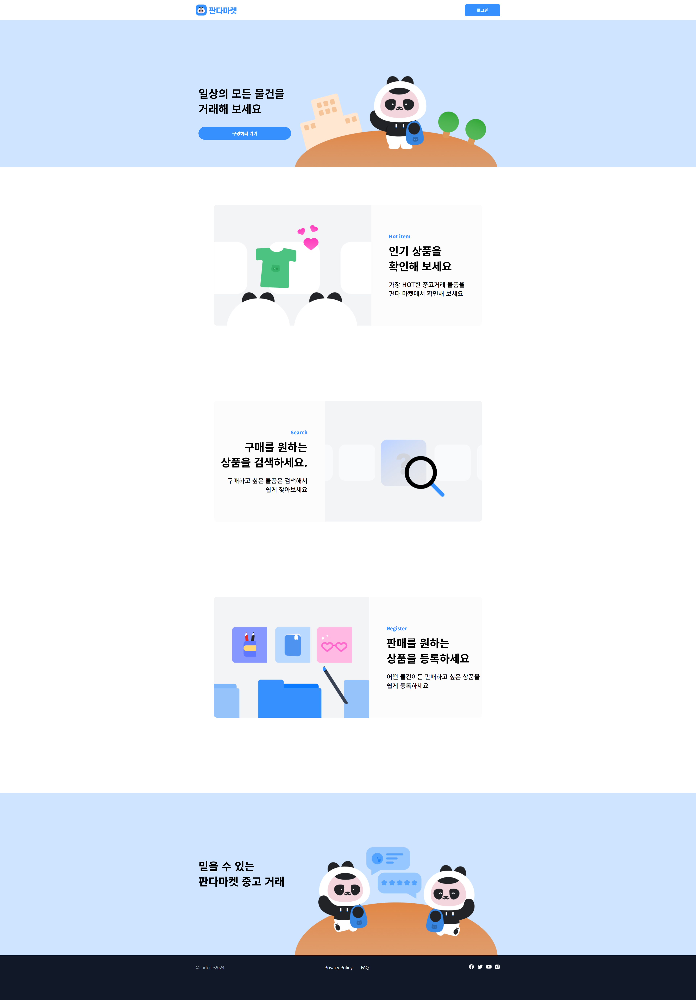
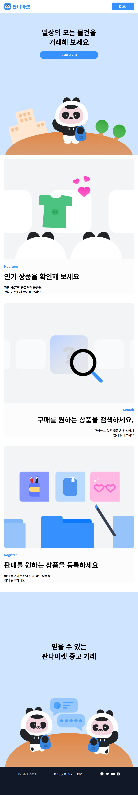
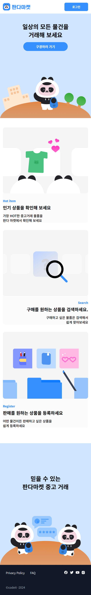
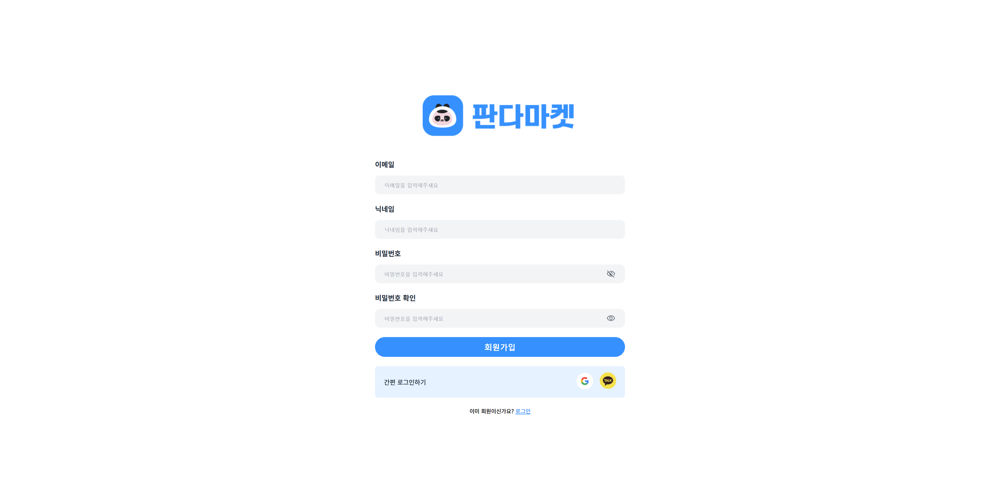
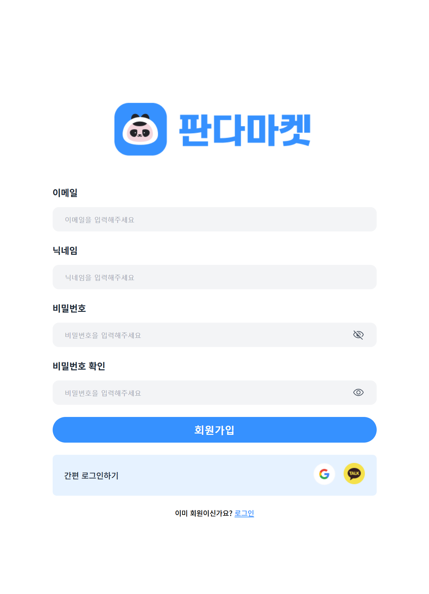
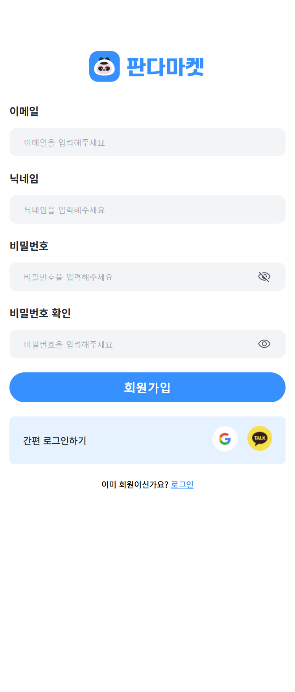
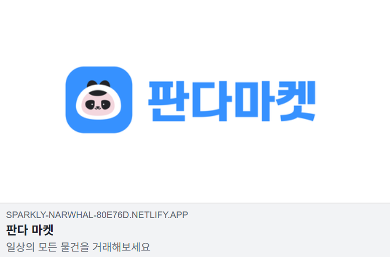

## 기본 요구사항

- [x] Github에 PR(Pull Request)을 만들어서 미션을 제출합니다.
- [x] 피그마 디자인에 맞게 페이지를 만들어 주세요.
- [x] React와 같은 UI 라이브러리를 사용하지 않고 진행합니다.

### 기본

공통

- [X] 브라우저에 현재 보이는 화면의 영역(viewport) 너비를 기준으로 분기되는 반응형 디자인을 적용합니다.
- [x] PC: 1200px 이상
- [x] Tablet: 768px 이상 ~ 1199px 이하
- [x] Mobile: 375px 이상 ~ 767px 이하
- [x] 375px 미만 사이즈의 디자인은 고려하지 않습니다.

랜딩 페이지

- [x] Tablet 사이즈로 작아질 때 “판다마켓” 로고의 왼쪽에 여백 24px, “로그인” 버튼 오른쪽 여백 24px을 유지할 수 있도록 “판다마켓” 로고와 “로그인" 버튼의 간격이 가까워집니다.
- [x] Mobile 사이즈로 작아질 때 “판다마켓” 로고의 왼쪽에 여백 16px, “로그인” 버튼 오른쪽 여백 16px을 유지할 수 있도록 “판다마켓” 로고와 “로그인" 버튼의 간격이 가까워집니다.
- [x] 화면 영역이 줄어들면 “Privacy Policy”, “FAQ”, “codeit-2024”이 있는 영역과 SNS 아이콘들이 있는 영역의 간격이 줄어듭니다.

로그인, 회원가입 페이지 공통

- [x] Tablet 사이즈에서 내부 디자인은 PC사이즈와 동일합니다.
- [x] Mobile 사이즈에서 좌우 여백 16px 제외하고 내부 요소들이 너비를 모두 차지합니다.
- [x] Mobile 사이즈에서 내부 요소들의 너비는 기기의 너비가 커지는 만큼 커지지만 400px을 넘지 않습니다.

### 심화

- [x] 페이스북, 카카오톡, 디스코드, 트위터 등 SNS에서 Linkbrary 랜딩 페이지(“/”) 공유 시 좌측 예시와 같은 미리보기를 볼 수 있도록 랜딩 페이지 메타 태그를 설정해 주세요.
- [x] 미리보기에서 제목은 “판다 마켓”, 설명은 “일상의 모든 물건을 거래해보세요”로 설정합니다.
- [x] 주소와 이미지는 자유롭게 설정하세요.

## 주요 변경사항 (Sprint1, 2 지적사항 수정)

- [x] 홈페이지 소개 부분 소개 스타일 수정
- [x] 로그인, 회원가입 간편 로그인하기 제목 태그 변경
- [x] 로그인, 회원가입 비밀번호 버튼 type 변경 및 input 관련 스타일 수정

## 스크린샷

메인 화면 (pc)

메인 화면 (tablet)

메인 화면 (mobile)

회원가입 화면 (pc)

회원가입 화면 (tablet)

회원가입 화면 (mobile)

facebook 미리보기

## 주강사님에게

- netlify 사이트 배포라서 그런건지 모르겠는데 meta name="twitter:site", meta property="og:url" 의 기능이 활성화되지 않는 것 같습니다.
- 트위터 meta 정보를 입력하였음에도 트위터에서 이미지가 출력되지 않습니다.
- meta 태그 관련 된 내용을 gpt를 통해 작성하였으나 많이 부족한 것 같습니다. 혹시 관련해서 추천할 만한 사이트나 정보를 알려주시면 추가로 공부해보도록 하겠습니다. 🙇‍♂️
- 셀프 코드 리뷰를 통해 질문 이어가겠습니다.

링크 제출 : [배포 링크](https://sparkly-narwhal-80e76d.netlify.app/)
