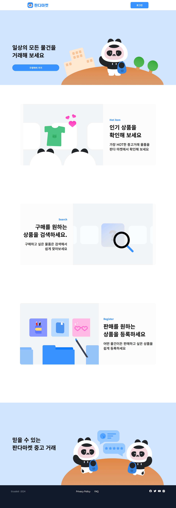
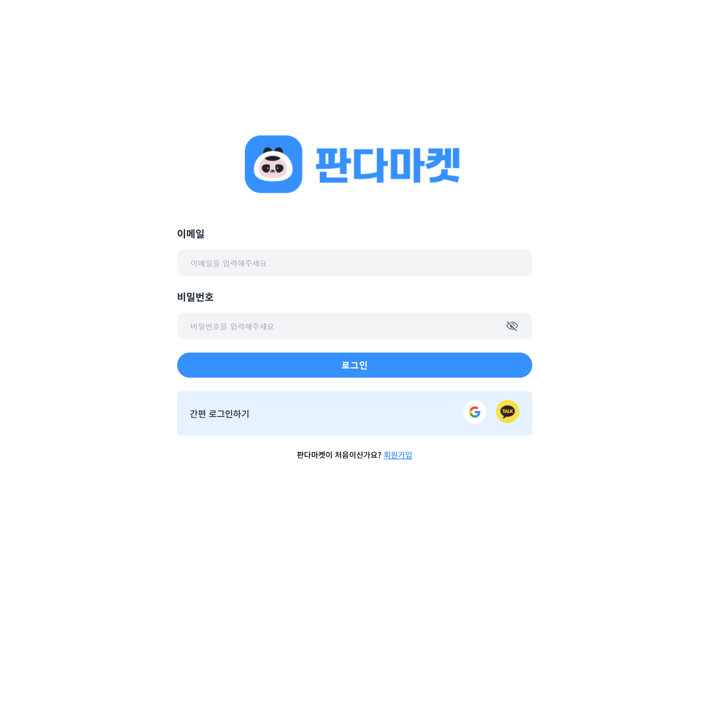
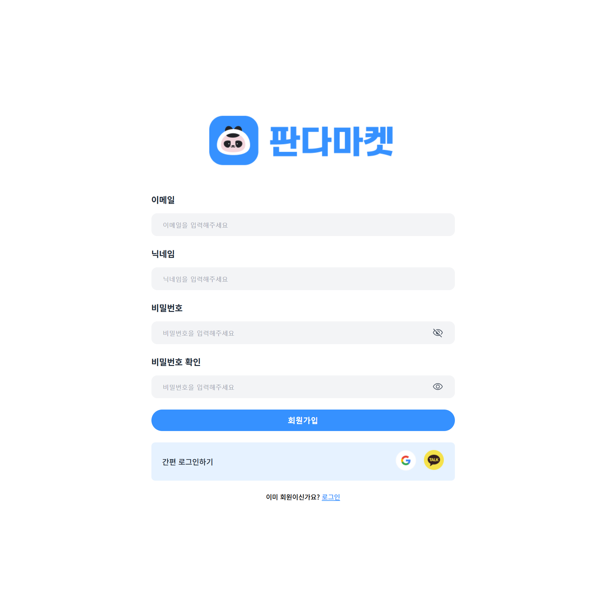

## 기본 요구사항

- [x] Github에 PR(Pull Request)을 만들어서 미션을 제출합니다.
- [x] Netlify에 파일 배포가 아닌 포크한 Github 레포지토리로 연결합니다.
- [x] 피그마 디자인에 맞게 페이지를 만들어 주세요.
- [x] React와 같은 UI 라이브러리를 사용하지 않고 진행합니다.

### 기본

공통

- [x] 아래로 스크롤 해도 상단 네비게이션 바(Global Navigation Bar)가 최상단에 고정됩니다.
- [x] "판다마켓" 클릭 시 루트 페이지("/")로 이동합니다.(새로고침)
- [x] 로그인 페이 지, 회원가입 페이지 모두 로고 위 상단  여백이 동일합니다.
- [x] SNS 아이콘들은 클릭시 각각 실제 서비스 홈페이지로 이동합니다.

로그인 페이지

- [x] "회원가입"버튼 클릭 시 "/signup" 페이지로 이동합니다.

회원가입 페이지

- [x] "로그인"버튼 클릭 시 "/login" 페이지로 이동합니다.

### 심화

- [x] palette에 있는 color값들을 css 변수로 등록하고 사용해 주세요.
- [x] 비밀번호 input 요소 위에 비밀번호를 확인할 수 있는 아이콘을 추가해 주세요.

## 주요 변경사항

- 

## 스크린샷

메인 화면

로그인 화면

회원가입 화면

## 주강사님에게

- 
- 셀프 코드 리뷰를 통해 질문 이어가겠습니다.

링크 제출 : [배포 링크](https://roaring-duckanoo-ccd586.netlify.app/) (아직 X)
